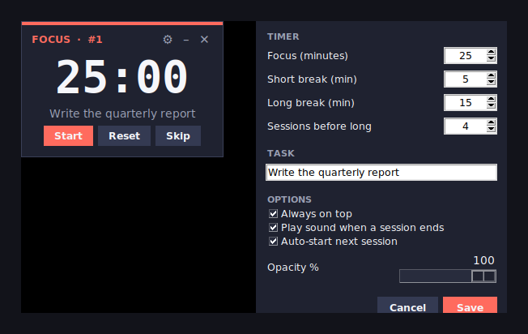

# 🍅 Pomodoro Timer

A tiny, always-on-top **floating Pomodoro timer for Windows 11**. It counts down your focus and break sessions, shows the task you're working on, and can be dragged anywhere on your screen. Built with pure Python + Tkinter — **no external dependencies**, so it stays light and fast.

It runs **only when you open it** (it does *not* auto-start with Windows) and closes instantly with a single click.

<p align="center">
  
</p>

---

## ✨ Features

- **Floating widget** that stays on top of your other windows.
- **Drag it anywhere** — grab the body and drop it; it remembers its spot.
- Shows the **countdown** and your **current task** ("what to do").
- **Focus → Short break → Long break** cycle with a session counter.
- **Settings window** (gear icon): durations, sessions before a long break, task text, always-on-top, end-of-session sound, auto-start, and opacity.
- **Compact mode** — shrink to a small time-only pill.
- **Keyboard shortcut** — press `Space` to start/pause.
- Settings and window position are **saved automatically**.
- **Zero dependencies** — only the Python standard library. The end-of-session beep uses Windows' built-in `winsound`.

---

## 🚀 Quick start

You have two ways to use it. Pick one.

### Option A — Run from source (fastest)

Requires [Python 3.8+](https://www.python.org/downloads/) installed.

```bash
python pomodoro.pyw
```

Or, on Windows, just **double-click `pomodoro.pyw`**. (If you use Anaconda, run the command from the **Anaconda Prompt** so Python is on your PATH.)

### Option B — Build a standalone `.exe` (double-click app)

This produces a single `Pomodoro.exe` that runs on any Windows PC **without Python installed**.

```bash
pip install pyinstaller
pyinstaller --onefile --windowed --icon pomodoro.ico --name Pomodoro pomodoro.pyw
```

The finished app appears in the new **`dist/`** folder as `dist/Pomodoro.exe`.

> On Windows you can also just double-click **`build_exe.bat`**, which runs the two commands above for you. Anaconda users: launch it from inside the Anaconda Prompt by typing `build_exe.bat`, because double-clicking it opens a plain Command Prompt that can't see Anaconda's Python.

To "install" the exe, right-click it → **Pin to Start**, or send a shortcut to your Desktop.

---

## 🎮 How to use

| Control | Action |
| --- | --- |
| **Start / Pause** | Big button, or press `Space` |
| **Reset** | Restart the current session |
| **Skip** | Jump to the next session (focus ↔ break) |
| ⚙ **Gear** | Open Settings |
| **–** | Shrink to a small time-only pill (click the square on it to expand) |
| **✕** | Close the app |
| **Drag body** | Move the widget anywhere; position is remembered |

### Settings

- **Focus / Short break / Long break** — length of each phase in minutes.
- **Sessions before long** — how many focus sessions before a long break.
- **Task** — the text shown while focusing.
- **Always on top** — keep the widget above other windows.
- **Play sound when a session ends** — beep on completion.
- **Auto-start next session** — roll straight into the next phase.
- **Opacity** — how see-through the widget is.

Your settings and last position are stored at:

```
%APPDATA%\PomodoroTimer\settings.json
```

---

## 🧰 Requirements

- **Windows 10 / 11** (the floating widget and sound are tuned for Windows; it will run elsewhere but the beep is skipped).
- **Python 3.8+** — only needed to run from source or to build the exe. End users of the built `.exe` need nothing.
- **PyInstaller** — only needed to build the exe (`pip install pyinstaller`).

---

## 🗑️ Uninstall

There's nothing formally installed. To remove it completely:

1. Delete the project folder (and the `dist/` / `build/` folders if you built the exe).
2. Remove any Start-menu pin or Desktop shortcut you made.
3. Delete the settings folder: press `Win + R`, enter `%APPDATA%\PomodoroTimer`, and delete it.

---

## 📁 Project structure

```
pomodoro-timer/
├── pomodoro.pyw        # the application
├── pomodoro.ico        # app icon
├── build_exe.bat       # one-click Windows build script
├── Run Pomodoro.vbs    # silent launcher (if Python is installed)
├── docs/
│   └── preview.png     # screenshot used in this README
├── .gitignore
├── LICENSE
└── README.md
```

---

## 🤝 Contributing

Issues and pull requests are welcome. Keep it dependency-free and lightweight — that's the whole point of the project.

---

## 📄 License

Released under the [MIT License](LICENSE). Do whatever you like with it.
